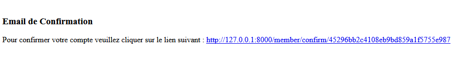
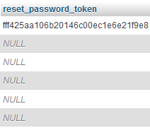
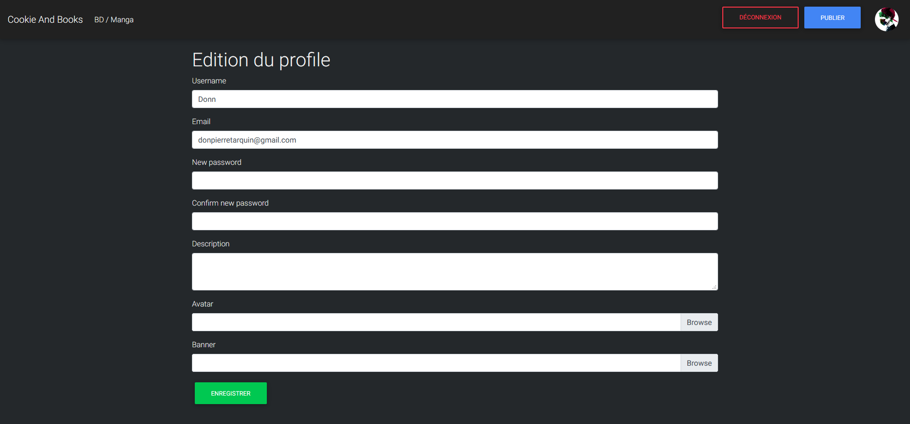

__Titre__ : Cookies and Books

__Description__ : Plateforme de publication et de lecture de manga et bande dessinées créer par les utilisateurs.

« Plateforme où les utilisateurs pourront lire des BD/Manga que d’autre utilisateur auront créé. »

__Publique visé__ : Les particuliers, tout public, francophone.

__Les langages utilisé pour ce projet__ :

__Front-End__ :

    -	HTML 5
    -	CSS 3 / SCSS
    -	EcmaScript 6 / Ajax(XMLHttpRequest / fetch) -> en cours
                Asynchronous Javascript And Xml (AJAX) : permet l'actualisation de certaines données d'une page sans procéder au rechargement total de cette page.
                Certains l'appel AJAJ car le XML est de plus en plus délaissé au profit du JSON.
    -	Framework :
            o	Bootstrap 4

__Back-End__ :

    -	PHP 7
    -	ORM Doctrine
    -	Framework :
        o	Symfony 4
        o	Moteur de templates :
            	Twig

Pourquoi Symfony 4 :

Il est actuellement à mon sens le plus accessible, dispose de moult service.
Une gestion des utilisateurs et de la sécurité simplifiée, dispose d’une barre d’outils de débogage web, une gestion des routes / URL et passage de paramètre simple.
Il dispose d’une documentation complète (peut-être un peu déroutante quand on débute).
Symfony intègre des mesures de sécurité préventives pour lutter contre les failles et attaques XSS, CSRF et injection SQL.
Contrairement à un développement PHP maison où il faut penser systématiquement à protéger chaque requête, formulaire … Symfony embarque systématiquement ces mécanismes de sécurité, sans avoir à les implémenter à chaque fois.
Forte communauté.

Charte Graphique :

Thème : Dark

Couleurs :

Police :

Rubik (à venir)

Responsive :

Inscription :

__Email__:

__Génération token email__ :

    md5(uniqid(mt_rand)) -> utilisé actuellement
        uniqid: Obtient un identifiant unique préfixé basé sur l'heure actuelle en microsecondes.

    md5(bin2hex(openssl_random_pseudo_bytes(6))) (à tester)

Authentification :

Mot de passe oublié:

Profile :

